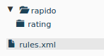
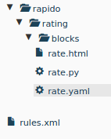
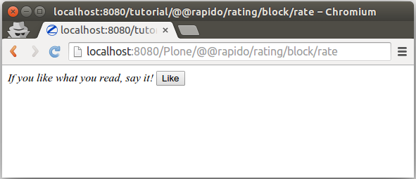
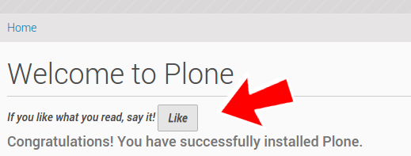
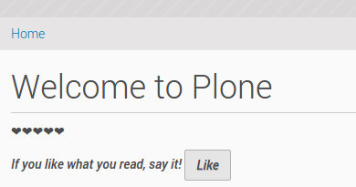
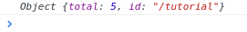
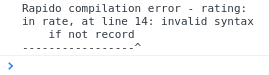
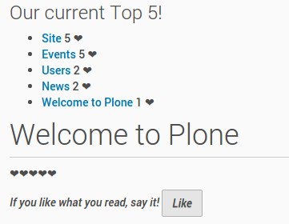
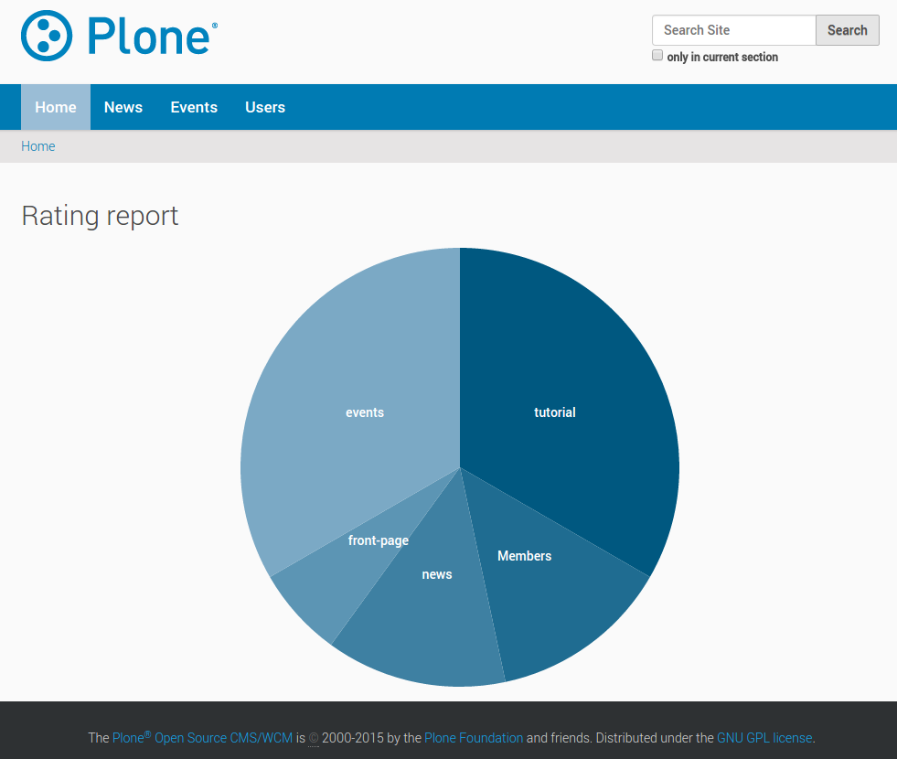

Tutorial
========

How to build a content rating system in Plone in few minutes.

Objective
---------

We want to offer to our visitors the ability to click on a *"Like"* button on any
Plone content, and the total of votes must be displayed next to the button.

.. note::

    There is a screencast covering the `first steps of the Rapido tutorial
    <https://www.youtube.com/watch?v=a7B-lX0caW0>`_.

Prerequisites
-------------

Run buildout to deploy Rapido and its dependencies (see :doc:`./installation`).

Install the ``rapido.plone`` add-on from Plone site setup.

Initializing the Rapido app
---------------------------

We go to Plone *Site setup*, and then *Theming*.

If our current active theme is not editable inline through the Plone web
interface (i.e. there is no *"Modify theme"* button),
we will first need to create an editable copy:

- click on *"Copy"*,
- enter a name, for example *"tutorial"*.
- check *"Immediately enable new theme"*.

Else, we just click on the *"Modify theme"* button.

We can see our theme structure, containing CSS files, images, HTML, and Diazo
rules.

To initialize our Rapido app named "rating", we need to:

- create a folder named ``rapido`` in the theme root,
- in this ``rapido`` folder, create a folder named ``rating``.

The application is now ready.

Creating the "Like" button
--------------------------

Rapido apps are composed of **blocks**. Let's create a block that will render
our button:

- go to the ``rating`` folder and create a new folder named ``blocks``,
- in this ``blocks`` folder, let's create a new block named ``rate``.
  To do this, we need to create 3 files:

The ``rate.html`` file:

.. code-block:: html

    <i>If you like what you read, say it! {like}</i>

This allows us to implement the block layout. It is a regular HTML file, but it
may contain Rapido **elements**, enclosed in brackets. In our case, we have
one element, namely ``{like}``, in charge of rendering the *"Like"* button.

The ``rate.py`` file

.. code-block:: python

    def like(context):
        # nothing for now
        pass

It provides the element's implementation. Each element in the block has a
corresponding Python function having the same id.
In our case, that is the code that will be executed when a user clicks on *"Like"*.
Right now, it does nothing, but we will change it later.

The ``rate.yaml`` file:

.. code-block:: yaml

    elements:
        like:
            type: ACTION
            label: Like

This file contains all the needed settings for our block. Here we declare that
our block contains one element named ``like``, which is an **action** (i.e. it
will be rendered as a button), and its displayed label is *"Like"*.

Now that our block is ready, we can see it using the following URL:

    http://localhost:8080/Plone/@@rapido/rating/blocks/rate

The next step is to embed our block in our Plone pages.

Inserting the block in Plone pages
----------------------------------

To include our block somewhere in Plone, we will use a Diazo rule.
Let's open our ``rules.xml`` file in the root of our theme, and add the following
lines:

.. code-block:: xml

    <after css:content=".documentFirstHeading">
        <include css:content="form" href="/@@rapido/rating/blocks/rate" />
    </after>

The ``include`` directive allows us to retrieve a piece of content;
in our case, the HTML form produced by our block.
And the ``after`` directive inserts it after the main title in our page.

So, now if we visit any page of our Plone site, we see our block displayed just
under the title.

That is nice, but there is a small problem: when we click on the *"Like"* button,
we are redirected to the raw block content, and we lose our current Plone page.

Let's fix that.

Staying in our Plone page
-------------------------

If we want to stay on our current page after submitting our block,
we need to enable **AJAX** mode.

To do this, let's change our ``rate.yaml`` file like this:

.. code-block:: yaml

    target: ajax
    elements:
        like:
            type: ACTION
            label: Like

Now, if we click on the *"Like"* button, the block is just reloaded dynamically,
and we stay in our current page.

Counting the votes
------------------

Let's go back to ``rate.py``, and focus on the ``like`` function implementation.

When a user clicks on the *"Like"* button, we need to get the current content the
user voted for, check how many votes it already has, and add one new vote.

Rapido allows to create **records**, so we will create a record for each content
item, and we will use the content path as an id.

So let's replace our current implementation with:

.. code-block:: python

    def like(context):
        content_path = context.content.absolute_url_path()
        record = context.app.get_record(content_path)
        if not record:
            record = context.app.create_record(id=content_path)
        total = record.get('total', 0)
        total += 1
        record['total'] = total

``context.content`` returns the current Plone content, and ``absolute_url_path`` is
a Plone method returning the path of a Plone object.

``context.app`` allows to access to the current Rapido app, so we can easily use
the Rapido API, like ``create_record`` or ``get_record``.

A Rapido record contains **items**. The ``get(item, default=none)`` method
returns the value of the requested item or the default value if the item does
not exist.

Displaying the votes
--------------------

Now we are able to store votes, we also want to display the *total* of votes.

Fist, let's change the block layout in ``rate.html``:

.. code-block:: html

    
{display}

    
<i>If you like what you read, say it! {like}</i>

So now we have a new ``display`` element in our block.

We must declare it in ``rate.yaml``:

.. code-block:: yaml

    target: ajax
    elements:
        like:
            type: ACTION
            label: Like
        display: BASIC

And let's implement it in ``rate.py``:

.. code-block:: python

    def display(context):
        content_path = context.content.absolute_url_path()
        record = context.app.get_record(content_path)
        if not record:
            return ''
        return "&#10084;" * record.get('total', 0)

We get the record corresponding to the current content, and we return as many ❤
as votes we have stored.

That's it! Our rating feature is ready to be used.

Debugging
---------

As we are writing code, we might (we will) make mistakes. In this case, , it is
always helpul to read the error messages returned by the system.

It is also very helpful to be able to log messages from our code, so we
understand what is going on exactly when it is executed.

Rapido provides the ``context.app.log()`` method which will log string messages
or any serializable object (dictionnaries, arrays, etc.).

The log messages and the error messages are visible in the server log (but we
might not be able to access it), but also in our browser's **javascript console**.

First thing to do is to enable the **debug mode** in our app.
To do that, we need to create a ``settings.yaml`` file in ``/rapido/rating``:

.. code-block:: yaml

    debug: true

And now, let's change our ``display`` function:

.. code-block:: python

    def display(context):
        content_path = context.content.absolute_url_path()
        record = context.app.get_record(content_path)
        if not record:
            return ''
        context.app.log(record.items())
        return "&#10084;" * record.get('total', 0)

We will see the following in our browser's console:

Let's imagine now we made an error like forgetting the colon at the end of the
``if`` statement:

.. code-block:: python

    def display(context):
        content_path = context.content.absolute_url_path()
        record = context.app.get_record(content_path)
        if not record
            return ''
        return "&#10084;" * record.get('total', 0)

Then we get this:

Listing the top 5 items
-----------------------

We would also like to see the top 5 rated content items on the site home page.

The first thing we need is to index the ``total`` element.

We declare its indexing mode in ``rate.yaml``:

.. code-block:: yaml

    target: ajax
    elements:
        like:
            type: ACTION
            label: Like
        display: BASIC
        total:
            type: NUMBER
            index_type: field

To index the previously stored values,
we have to refresh the storage index by calling the following URL:

    http://localhost:8080/Plone/@@rapido/rating/refresh

And to make sure future changes will be indexed,
we need to fix the ``like`` function in the ``rate`` block:
the indexing is triggered when we call the record's ``save`` method:

.. code-block:: python

    def like(context):
        content_path = context.content.absolute_url_path()
        record = context.app.get_record(content_path)
        if not record:
            record = context.app.create_record(id=content_path)
        total = record.get('total', 0)
        total += 1
        record['total'] = total
        record.save(block_id='rate')

We are now able to build a block to display the top 5 contents:

- ``top5.html``:

.. code-block:: html

    <h3>Our current Top 5!</h3>
    {top}

- ``top5.yaml``:

.. code-block:: yaml

    elements:
        top: BASIC

- ``top5.py``:

.. code-block:: python

    def top(context):
        search = context.app.search("total>0", sort_index="total", reverse=True)[:5]
        html = "<ul>"
        for record in search:
            content = context.api.content.get(path=record["id"])
            html += '<li><a href="%s">%s</a> %d &#10084;</li>' % (
                content.absolute_url(),
                content.title,
                record["total"]) 
        html += "</ul>"
        return html

The ``search`` method allows us to query our stored records. The record ids are
the content paths, so using the Plone API (``context.api``), we can easily
get the corresponding contents, and then obtain their URLs and titles.

Our block works now:

    http://localhost:8080/Plone/@@rapido/rating/blocks/top5

Finally, we have to insert our block in the home page.
That will be done in ``rules.xml``:

.. code-block:: xml

    <rules css:if-content=".section-front-page">
        <before css:content=".documentFirstHeading">
            <include css:content="form" href="/@@rapido/rating/blocks/top5" />
        </before>
    </rules>

Creating a new page for reports
-------------------------------

For now, we have just added small chunks of HTML in existing pages. But Rapido
also allows us to create a new page (a Plone developer would name it a new `view`).

Let's pretend we want to create a report page about the votes on the content of
a folder.

First, we need a block, ``report.html``:

.. code-block:: html

    <h2>Rating report</h2>
    

We want this block to be the main content of a new view.

We need to declare it in a new YAML file called ``report.yaml``:

.. code-block:: yaml

    view:
        id: show-report
        with_theme: true

Now if we visit for instance:

    http://localhost:8080/Plone/@@show-report

we do see our block as main page content.

Now we need to implement our report content. We could do it with a Rapido element
like we did in the Top 5 block.

Let's change our approach and implement a fancy pie chart using the 
`amazing D3js library <http://d3js.org/>`_ and the :doc:`Rapido REST API <./rest>`.

We need to create a Javascript file (``report.js``) in the ``/rapido/rating``
folder:

.. code-block:: javascript

    // Source: http://rapidoplone.readthedocs.io/en/latest/tutorial.html#creating-a-new-page-for-reports
    /* It is a feature of the RequireJS library
     * (provided with Plone by default) to load
     * our dependencies like:
     * - mockup-utils, which is a Plone internal resource,
     * - D3js (and we load it by passing its remote URL to RequireJS).
     */
    require(['mockup-utils', '//d3js.org/d3.v3.min.js'], function(utils, d3) {
        /* Get the Plone getAuthenticator method
         * mockup-utils allows us to get the authenticator token
         * (with the getAuthenticator method), we need it to use
         * the Rapido REST API.
         */
        var authenticator = utils.getAuthenticator();
        // Get the local folders path
        var local_folder_path = location.pathname.split('/@@rapido')[0];
        // Get SVG element from the rapido block html named 'report.html'
        var width = 960,
            height = 500,
            radius = Math.min(width, height) / 2;

        /* d3.js Arc Generator
         * Generates path data for an arc (typically for pie charts).
         */
        var arc = d3.svg.arc()
            .outerRadius(radius - 10)
            .innerRadius(0);

        /* d3.js Pie Chart Generator
         * Generates data from an array of data.
         */
        var pie = d3.layout.pie()
            .sort(null)
            .value(function(d) { return d.value; });
        
        var svg = d3.select("#chart").append("svg")
            .attr("width", width)
            .attr("height", height)
            .append("g")
            .attr("transform", "translate(" + width / 2 + "," + height / 2 + ")");

        // d3.json() calls the Rapido endpoint @@rapido/rating/search (a rest api endpoint)
        d3.json("@@rapido/rating/search")
            // d3.json() puts the authenticator token in the X-Csrf-Token header,
            .header("X-Csrf-Token", authenticator)
            // and d3.json() passes the search query in the request BODY.
            .post(
                JSON.stringify({"query": "total>0"}),
                function(err, results) {
                    var data = [];
                    var color = d3.scale.linear().domain([0,results.length]).range(["#005880","#9abdd6"]);
                    var index = 0;
                    results.forEach(function(d) {
                        var label = d.items.id.split('/')[d.items.id.split('/').length - 1];
                        data.push({
                            'i': index,
                            'value': d.items.total,
                            'label': label
                        });
                        index += 1;
                    });

                    // add arc element
                    var g = svg.selectAll(".arc")
                        // call pie() function
                        .data(pie(data))
                        // add g element
                        .enter().append("g")
                        .attr("class", "arc");
                
                    // add path element
                    g.append("path")
                        .attr("d", arc)
                        .style("fill", function(d) { return color(d.data.i); });
                
                    // add text element
                    g.append("text")
                        .attr("transform", function(d) { return "translate(" + arc.centroid(d) + ")"; })
                        .attr("dy", ".35em")
                        .style("text-anchor", "middle")
                        .text(function(d) { return d.data.label; })
                        .style("fill", "white");
                }
            );
    });

That is quite a complex script, and we will not detail here the D3js-related
aspects (it is just a typical example to draw a pie chart); we will focus on
the way we obtain the data.

The first thing to notice is the ``require`` function. It is a feature of the
RequireJS library (provided with Plone by default) to load our dependencies.

We have 2 dependencies:

- ``mockup-utils``, which is a Plone internal resource,
- D3js (and we load it by passing its remote URL to RequireJS).

``mockup-utils`` allows us to get the authenticator token (with the ``getAuthenticator``
method), we need it to use the Rapido REST API.

.. note ::

    - RequireJS or ``mockup-utils`` are not mandatory to use the Rapido REST API,
      if we were outside of Plone (using Rapido as a remote backend),
      we would have made a call to ``../@@rapido/rating`` which returns the
      token in an HTTP header.
      We just use them because they are provided by Plone by default, and they make our
      work easier.
    - Instead of loading D3 directly form its CDN, we could have put the ``d3.v3.min.js``
      in the ``/rapido/rating`` folder, and serve it locally.

The second interesting part is the ``d3.json()`` call:

- it calls the ``@@rapido/rating/search`` endpoint,
- it puts the authenticator token in the ``X-Csrf-Token`` header,
- and it passes the search query in the request BODY.

That is basically what we need to do whatever JS framework we use (here we
use D3, but it could be a generalist framework like Angular, Backbone, Ember, etc.).

Now we just need to load this script from our block:

.. code-block:: html

    <h2>Rating report</h2>
    

    

And we can visit:

    http://localhost:8080/Plone/news/@@show-report

to see a pie chart about votes on the *News* items!!

Download the :download:`source files of this tutorial <files/tutorial.zip>`.

.. note::

    This .zip file can be imported in the theming editor, but it cannot be activated as a regular theme as it just contains our Rapido app.
    The app can be used from our main theme by adding a `rating.lnk` file in our current theme's ``rapido`` folder, containing::

        tutorial

    indicating the Rapido app named ``rating`` is stored in the theme named ``tutorial``.
    And then we can activate our specific rules by adding:

    .. code-block:: xml

        <after css:content=".documentFirstHeading">
            <include css:content="form" href="/@@rapido/rating/blocks/rate" />
        </after>

        <rules css:if-content=".section-front-page">
            <before css:content=".documentFirstHeading">
                <include css:content="form" href="/@@rapido/rating/blocks/top5" />
            </before>
        </rules>

    in our main theme's ``rules.xml``.
