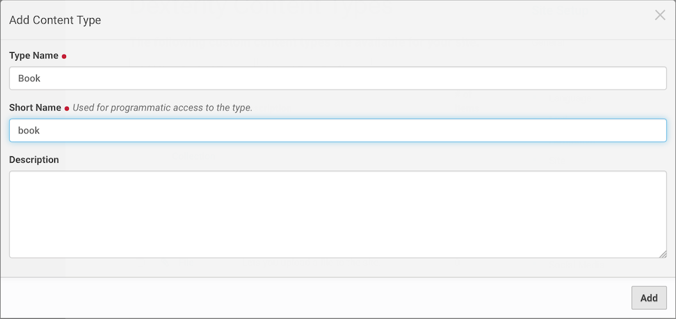
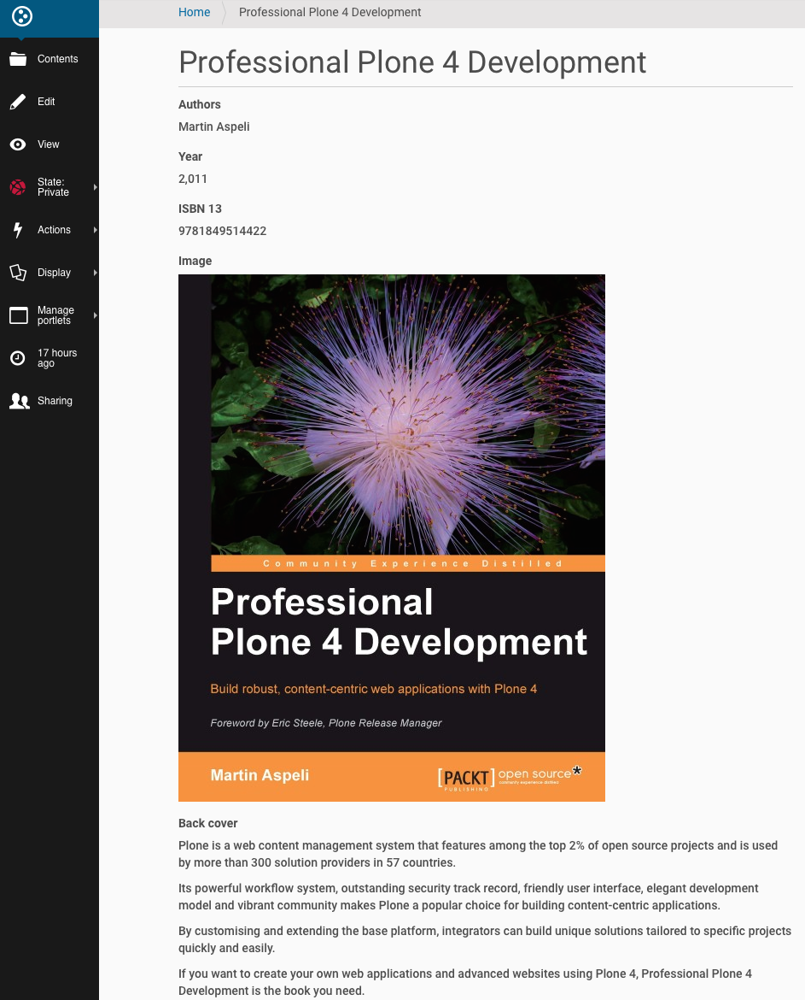
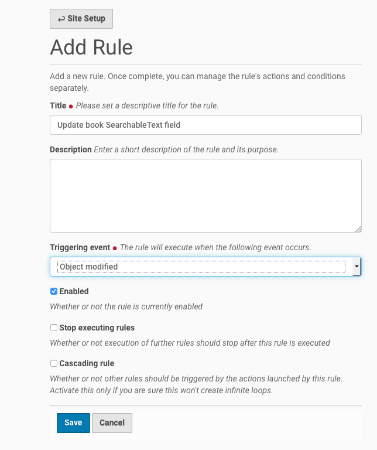
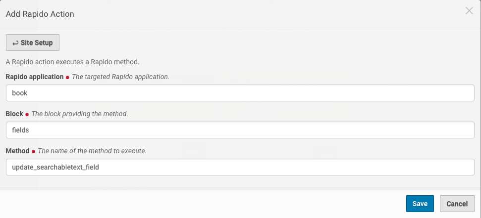
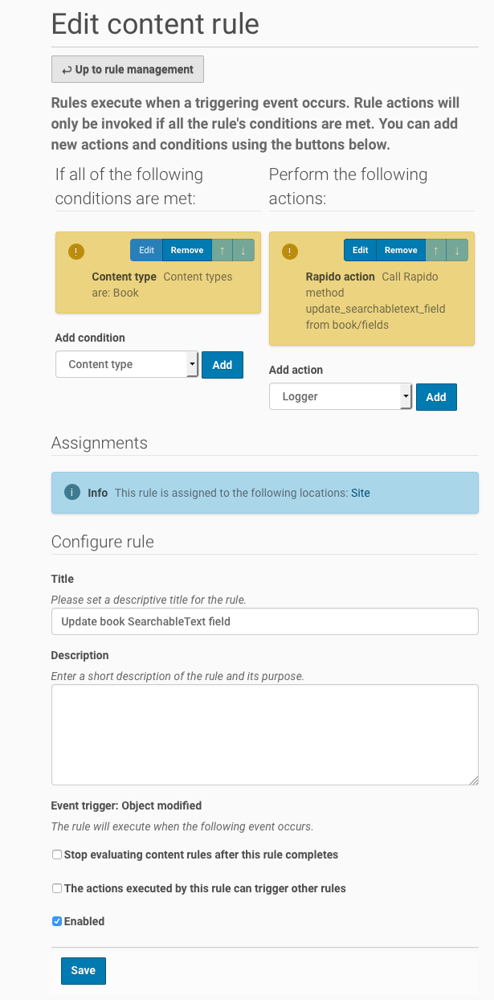

Use *Rapido* to create custom *SearchableText* field
====================================================

Objective
---------

Create TTW (Through The Web) a book content type where fields are indexed for a full-text search.

Content type
------------

Add a new content type *Book* on the *Dexterity Content Types* control panel
(http://localhost:8080/Plone/@@dexterity-types).

Edit the Book configuration (http://localhost:8080/Plone/dexterity-types/book).
In the *Behaviors* tab, uncheck the *Dublin Core metadata* behavior and *Save*.
In the *Fields* tab, click on the *Edit XML Field Model* button and replace the XML model by:

.. code-block:: xml

    <model xmlns:form="http://namespaces.plone.org/supermodel/form"
           xmlns:i18n="http://xml.zope.org/namespaces/i18n"
           xmlns:lingua="http://namespaces.plone.org/supermodel/lingua"
           xmlns:marshal="http://namespaces.plone.org/supermodel/marshal"
           xmlns:security="http://namespaces.plone.org/supermodel/security"
           xmlns:users="http://namespaces.plone.org/supermodel/users"
           xmlns="http://namespaces.plone.org/supermodel/schema">
      <schema>
        <field name="title" type="zope.schema.TextLine">
          <description/>
          <title>Title</title>
        </field>
        <field name="authors" type="zope.schema.Text">
          <description/>
          <required>False</required>
          <title>Authors</title>
        </field>
        <field name="year" type="zope.schema.Int">
          <description/>
          <required>False</required>
          <title>Year</title>
        </field>
        <field name="isbn_13" type="zope.schema.TextLine">
          <description/>
          <max_length>13</max_length>
          <min_length>13</min_length>
          <required>False</required>
          <title>ISBN 13</title>
        </field>
        <field name="image" type="plone.namedfile.field.NamedBlobImage">
          <description/>
          <required>False</required>
          <title>Image</title>
        </field>
        <field name="back_cover" type="plone.app.textfield.RichText">
          <description/>
          <required>False</required>
          <title>Back cover</title>
        </field>
      </schema>
    </model>

You can now add *Book* content in your web site (http://localhost:8080/Plone/++add++book).

Full text search field
----------------------

If you have a lot of books in your site, you would like to search on the author's name or the back cover content.
To do this we have to provide a *SearchableText* method or field which give the content of the full-text index.
We'll use a *rapido block* and a *rapido content rule action* to compute this *SearchableText* field.

Rapido block
............

Go to the *Theming* control panel (http://localhost:8080/Plone/@@theming-controlpanel).
Create a new theme *MyTheme* with this structure. 

.. code-block:: bash

    index.html
    manifest.cfg
    rapido/
        book/
            blocks/
                fields.py
    rules.xml
  
Look for example at the
`Inheriting a new theme from Barceloneta <http://docs.plone.org/adapt-and-extend/theming/barceloneta.html#inheriting-a-new-theme-from-barceloneta>`_
section of the Plone documentation for the content of *index.html*, *manifest.cfg* and *rules.xml* files.

Content of *fields.py* file:

.. code-block:: python

  def update_searchabletext_field(context):
      transforms = context.api.portal.get_tool(name='portal_transforms')
      book = context.content
      back_cover_html = book.back_cover.output if book.back_cover else ""
      back_cover_plain = transforms.convertTo(
          'text/plain', back_cover_html, mimetype='text/html').getData()
      book.SearchableText = " ".join([
          book.title if book.title else "",
          book.authors if book.authors else "",
          str(book.year) if book.year else "",
          book.isbn_13 if book.isbn_13 else "",
          back_cover_plain
      ])
      book.reindexObject(idxs=['SearchableText'])

We use the *portal_transforms* tool to convert the back_cover html field in plain text.
We also need to reindex the content.

Rapido content rule action
..........................

The last thing we need is a *rapido content rule action*  which is used on each book modification.

Go to the *Content Rules* (http://localhost:8080/Plone/@@rules-controlpanel) and add a rule which is triggered on *Object modified* event.

Add a *Content type* condition on *Book*.
Add a *Rapido action*.

Assign the content rule on the whole site and *Save*.

Exercise
--------

Modify the code above to compute a *Description* field who will be used in Plone listings.

Custom book view
----------------

To build a custom book view the simplest solution is to use a *diazo* rule.

For example, you can add in the *rules.xml* file of your theme the following *diazo rule*:

.. code-block:: xml

    <rules css:if-content="body.template-view.portaltype-book">
      <replace css:content="#content-core" method="raw">
        <xsl:variable name="image_url">
          <xsl:value-of select="substring-before(//span[@id='form-widgets-image']/img/@src,'view')"/>
        </xsl:variable>
        

            

                <xsl:if test="$image_url">
                    
                </xsl:if> 
            

            

                
<strong>Author(s) : </strong><xsl:copy-of css:select="#form-widgets-authors" />

                
<strong>ISBN-13(s) : </strong><xsl:copy-of css:select="#form-widgets-isbn_13" />

                
<strong>Year : </strong><xsl:copy-of css:select="#form-widgets-year" />

                
<xsl:copy-of css:select="#formfield-form-widgets-back_cover" />

            

        

      </replace>
    </rules>

Our new custom book views:

