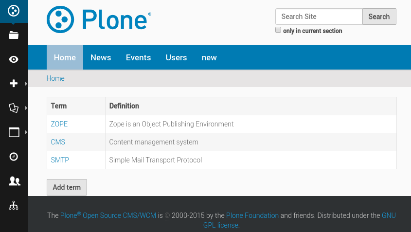
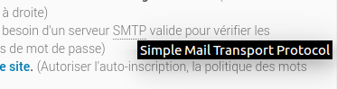

Glossary use case
===================

Objective
---------

We want to provide a tool to manage a list of terms and their definitions:

Every time one of these terms appears on a page of our site, it will be wrapped
into a `<abbr>` tag, the title of which will be the definition, so when we
hover a term, we get a small popup indicating its definition:

Application structure
---------------------

.. code-block:: bash

    rapido/
        glossary/
            blocks/
                all.html
                all.py
                all.yaml
                term.html
                term.py
                term.yaml
            glossary.js
    rules.xml

Rules.xml
---------

.. code-block:: xml

    <rules if-path="@@rapido/view/manage-glossary">
      <replace css:content="#content">
        <include css:content="form" href="/@@rapido/glossary/blocks/all" />
      </replace>      
    </rules>
    <after css:theme-children="body">
      
    </after>

The first rule declares a view named ``manage-glossary`` displaying the ``all``
block.

The second rule inserts in all our pages a javascript file in charge of replacing
matching words with ``<abbr>`` tags.

The ``term`` block
------------------

This block is a form allowing to create/edit/delete a glossary term. It contains
two field elements and three actions.

- ``term.html``

  .. code-block:: html
  
      
<label>Term</label> {term}

      
<label>Definition</label> {definition}

      {_save} {_delete} {close}

- ``term.yaml``

  .. code-block:: yaml
  
      target: ajax
      elements:
          term: TEXT
          definition: TEXT
          close:
              type: ACTION
              label: Close
          _save:
              type: ACTION
              label: Save
          _delete:
              type: ACTION
              label: Delete

- ``term.py``

  .. code-block:: python
  
      def close(context):
          return context.app.get_block('all').url
      
      def on_save(context):
          return context.app.get_block('all').url
      
      def on_delete(context):
          return context.app.get_block('all').url

If we click on any action in this block, we want to be redirected to the main
management page. We do that by returning the ``all`` block URL (when an action
returns a string, it is used as a redirection URL).

The ``all`` block
-----------------

This block lists all the existing terms in a table.
When we click on a term, we open it in the ``term`` block in edit mode,
and a button allows opening a blank ``term`` block to create a new term.

- ``all.html``

  .. code-block:: html
  
      <table class="listing"><tr><th>Term</th><th>Definition</th></tr>
      {list}
      </table>
      {new_term}

- ``all.yaml``

  .. code-block:: yaml
  
      target: ajax
      elements:
          list: BASIC
          new_term:
              type: ACTION
              label: Add term

- ``all.py``

  .. code-block:: python
  
      def list(context):
          html = u""
          for record in context.app.records():
              html += """<tr><td><a href="%s/edit" target="ajax">%s</a></td><td>%s</td></tr>""" % (
                  record.url,
                  record['term'],
                  record['definition'],
              )
          return html
  
      def new_term(context):
          return context.app.get_block('term').url

The ``list`` function builds a table row for each existing record,
displaying the *term* value and the *definition* value.
The link we put on the term targets the record URL (plus `/edit` to open it in edit mode)
and we have added `target="ajax"` so the resulting page is not displayed as a full page,
it is just loaded into the current block in AJAX mode.

The Javascript
--------------

- ``glossary.js``

  .. code-block:: javascript
  
      require(['jquery'], function($) {
          if($('.template-edit').length > 0) {
              return
          }
          $.getJSON('/tutorial/@@rapido/glossary/records', function(data) {
              var keys = [];
              var values = {};
              for(var i=0; i<data.length; i++) {
                  term = data[i].items.term;
                  definition = data[i].items.definition;
                  keys.push(term);
                  values[term] = definition;
              }
              var re = RegExp("(\\W)(" + keys.join("|") + ")(\\W)", "g");
              function replaceNodeText() {
               if (this.nodeType === 3) {
                      var parent = $(this).parent();
                      var html = parent.html();
                      if(html) {
                          var newvalue = html.replace(re, function(){
                              var term = arguments[2],
                                  before = arguments[1],
                                  after = arguments[3];
                              term = '<abbr title="'+values[term]+'">'+term+'</abbr>';
                              return before + term + after;
                          });
                          parent.html(newvalue);
                      }
               } else {
                   $(this).contents().each(replaceNodeText);
               }
              }
              $("#content-core").contents().each(replaceNodeText);
          });
      });

First thing we do is to check if we are in edit mode, and if we are, we stop, as
we do not want to manipulate the HTML currently being edited in TinyMCE or in any
input field.

Then we load the glossary terms with the following JSON call:
``/tutorial/@@rapido/glossary/records``

Using the term values we have loaded, we build a regular expression able to
match those terms in any text.

Then we iterate on the page main content (`#content-core`) elements, and every
time we find a text node, we use our regular expression to replace the matching
words with an `<abbr>` tag where the `title` attribute is the associated
definition.
